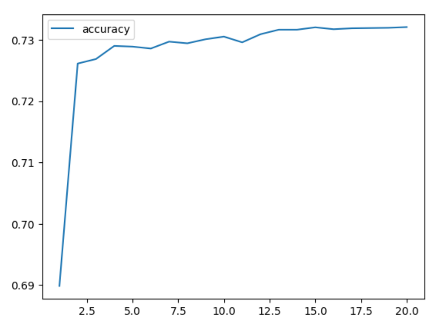

# deep-learning-challenge
Module 21 Challenge

## Background
The nonprofit foundation Alphabet Soup wants a tool that can help it select the applicants for funding with the best chance of success in their ventures. With your knowledge of machine learning and neural networks, you’ll use the features in the provided dataset to create a binary classifier that can predict whether applicants will be successful if funded by Alphabet Soup.

From Alphabet Soup’s business team, you have received a CSV containing more than 34,000 organizations that have received funding from Alphabet Soup over the years. Within this dataset are a number of columns that capture metadata about each organization, such as:

- EIN and NAME—Identification columns
- APPLICATION_TYPE—Alphabet Soup application type
- AFFILIATION—Affiliated sector of industry
- CLASSIFICATION—Government organization classification
- USE_CASE—Use case for funding
- ORGANIZATION—Organization type
- STATUS—Active status
- INCOME_AMT—Income classification
- SPECIAL_CONSIDERATIONS—Special considerations for application
- ASK_AMT—Funding amount requested
- IS_SUCCESSFUL—Was the money used effectively

## Step 1: Preprocess the Data
Using your knowledge of Pandas and scikit-learn’s StandardScaler(), you’ll need to preprocess the dataset. This step prepares you for Step 2, where you'll compile, train, and evaluate the neural network model.

## Step 2: Compile, Train, and Evaluate the Model
Using your knowledge of TensorFlow, you’ll design a neural network, or deep learning model, to create a binary classification model that can predict if an Alphabet Soup-funded organization will be successful based on the features in the dataset. You’ll need to think about how many inputs there are before determining the number of neurons and layers in your model. Once you’ve completed that step, you’ll compile, train, and evaluate your binary classification model to calculate the model’s loss and accuracy.

## Step 3: Optimize the Model
Using your knowledge of TensorFlow, optimize your model to achieve a target predictive accuracy higher than 75%.

## Results
### Processing the Data
- the target of this model is the binary variable 'IS_SUCCESSFUL'
- the following variables ar e the features of the model:
  - APPLICATION_TYPE
  - AFFILIATION
  - CLASSIFICATION
  - USE_CASE
  - ORGANIZATION
  - INCOME_AMT
  - SPECIAL_CONSIDERATIONS
  - ASK_AMT
- the two variables within the dataset that were removed because they were neither targets nor features:
  - EIN
  - NAMES

## Compiling, Training, and Evaluating the Model
To begin with a simple model, the original network consisted of the following elements:
  - 2 hidden layers with 6 nodes each
  - 20 epochs
  - the first layer was designated as relu and the the second was designated as sigmoid
  - the output layer was defined as sigmoid as the prediction would be either 0 or 1

With an accuracy of **72.51%** the results of the original model did not meet the performance goal of 75%.

### (Original Model - 72.51% accuracy)

## Optimization attempts
Attempts at optimization included the following changes:

First, the epochs were increased from 20 to 40, resulting in an accuracy of **72.73%**.

### (Increasing epochs to 40 - 72.73% accuracy)

Next, the ASK_AMT feature was binned with 9 unique values. It was noticed that 5000 was the minimum and most popular amount. There none below that and the amounts ranged to over 800,000,000. This was an opportunity to eliminate possible outliers in the column and categorize the feature.

Many stepwise adjustments were then made to the model to understand what might improve or degrade the accuracy, including:
  - adding hidden layers
  - changing layer models between relu and sigmoid
  - increasing and decreasing number of nodes in each layer
  - changing the shape of the neural network (number of nodes within the layers)
    - 12-12-12
    - 8-12-8
    - 6-8-10
    - 10-8-6 (this proved the most impactful)
  - removing features, like "STATUS' and 'SPECIAL_CONSIDERATIONS' (had very little impact)

The top accuracy with these changes had 3 hidden layers with the following characteristics:
    - 10 relu nodes
    - 8 sigmoid nodes
    - 6 sigmoid nodes

Along with binning the 'ASK_AMOUNT', these improvements increased the accuracy to only **72.84%**.

### (After binning ASK_AMT - 72.84% accuracy)

Finally, an attempt to place 'NAMES' back into the dataset was attempted in several different ways by adjusting bin sizes. With 'NAMES' divided into 31 bins, the accuracy surpassed the goal with a score of **75.42**%. 

Though this last change accomplished the goal of over 75% accuracy, it comes with a precaution as explained in the summary below.

### (Adding back 'NAMES' - 75.42% accuracy)

## Summary

The original model resulted in an accuracy of **72.51%** which did not meet the goal of 75%.

Optimization was explored on the model which did not accomplish much increase in accuracy. The highest observed was **72.84%**.

As further exploration of model behavior, the attempt to add back in the 'NAMES' column proved to increase the accuracy. However, as stated in the original model, the 'NAMES' column was removed from the dataset because it is considered a non-beneficial ID column. The results of adding this column back into the dataset, and thus into the model, is likely showing the effects of the model 'memorizing' or overfitting the data. Because the goal of 75% accuracy was not achieved prior to this change, this model is not recommended to represent the problem set. 

  

